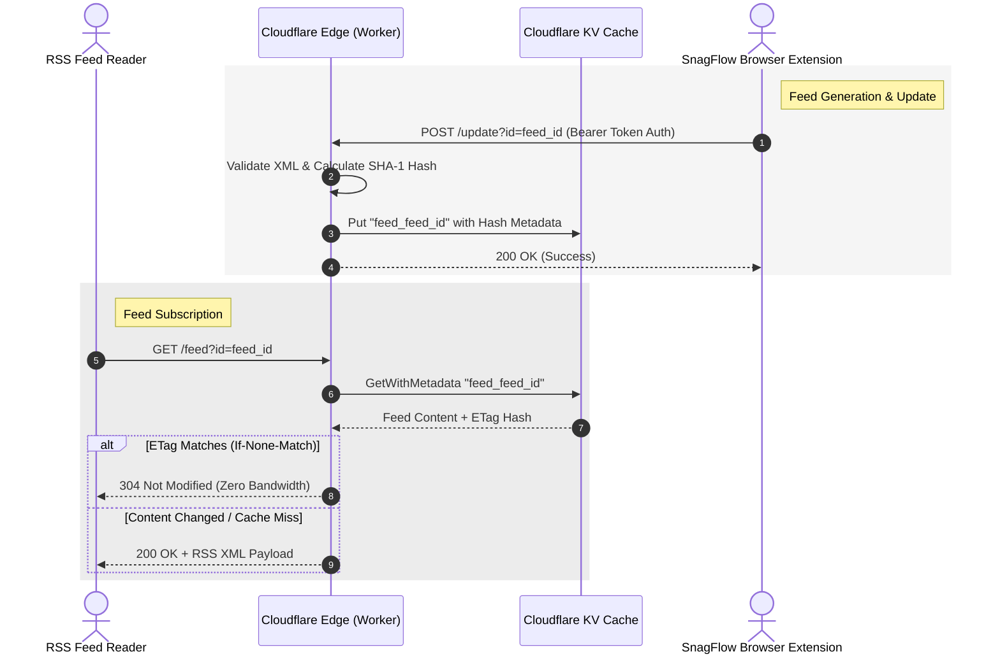

# 🛰️ SnagFlow RSS Bridge (Premium Edition)

[English](README.md) | [简体中文](README_zh.md)

[](https://deploy.workers.cloudflare.com/?url=https://github.com/Pizone-ai/snagflow-rss-bridge)
[](LICENSE)
[](https://workers.cloudflare.com/)

An ultra-fast, lightweight, and secure serverless gateway built on **Cloudflare Workers** and **Cloudflare KV**. It serves as the public distribution bridge for RSS feeds generated locally by the **SnagFlow** visual selection extension.

---

## 🛠️ Architecture

The RSS Bridge acts as a secure, globally distributed cache that decouples your local browser extension sync from public RSS subscribers.



---

## 🚀 Key Features

*   **Global Low Latency**: Powered by Cloudflare's edge network, achieving sub-millisecond response times.
*   **Highly Cost-Effective**: Uses Cloudflare KV for serverless storage, fits perfectly within Cloudflare's generous free tier (100k requests/day).
*   **Smart HTTP Caching**: Implements robust `ETag` validation and `If-None-Match` checks, returning `304 Not Modified` to save server bandwidth and reader resources.
*   **Secure API Updates**: Protects update endpoints via Bearer Token authorization (`AUTH_TOKEN`), preventing unauthorized feed overwrites.
*   **HEAD Request Support**: Handles lightweight `HEAD` requests for feed status checking without full XML payload transfers.

---

## 🚦 API Endpoints

### 1. GET `/feed`
Retrieve the RSS feed XML content.

*   **URL**: `/feed?id=<FEED_ID>`
*   **Method**: `GET`
*   **Headers**:
    *   `If-None-Match` (Optional) - Sends the cached ETag.
*   **Response**:
    *   `200 OK`: Returns the full RSS XML document.
    *   `304 Not Modified`: Returned if the feed has not changed since the last request.
    *   `404 Not Found`: Feed ID does not exist in the cache.

### 2. HEAD `/feed`
Check the existence and ETag status of a feed.

*   **URL**: `/feed?id=<FEED_ID>`
*   **Method**: `HEAD`
*   **Response**:
    *   `200 OK`: Returns same headers as `GET` (including ETag) but no response body.

### 3. POST `/update`
Update/Upload the RSS XML content. Typically invoked automatically by the SnagFlow extension.

*   **URL**: `/update?id=<FEED_ID>`
*   **Method**: `POST`
*   **Headers**:
    *   `Authorization`: `Bearer <YOUR_AUTH_TOKEN>` (If configured)
    *   `Content-Type`: `application/xml`
*   **Request Body**: Raw RSS XML text.
*   **Response**:
    *   `200 OK`: "Success"
    *   `401 Unauthorized`: Invalid or missing authorization token.
    *   `400 Bad Request`: Content is empty, too short, or lacks a valid `<?xml` declaration.

---

## ⚙️ Configuration & Deployment

### Prerequisites

Ensure you have [Node.js](https://nodejs.org/) installed and Wrangler CLI configured:

```bash
npm install -g wrangler
wrangler login
```

### 1. Create KV Namespace

Create a new Cloudflare KV namespace to store your RSS feeds:

```bash
wrangler kv:namespace create RSS_CACHE
```

This will output the configuration binding. Copy it and update your `wrangler.toml`:

```toml
[[kv_namespaces]]
binding = "RSS_CACHE"
id = "YOUR_KV_NAMESPACE_ID"
```

### 2. Environment Variables

To protect your update endpoint, configure an `AUTH_TOKEN` secret:

#### Local Development
Create a `.dev.vars` file in the root directory:
```env
AUTH_TOKEN="your-secure-token"
```

#### Production Deployment
Upload the secret securely to Cloudflare:
```bash
wrangler secret put AUTH_TOKEN
```

### 3. Deploy

Deploy your worker globally:

```bash
wrangler deploy
```

---

## 📄 License

This project is licensed under the MIT License - see the [LICENSE](LICENSE) file for details.
