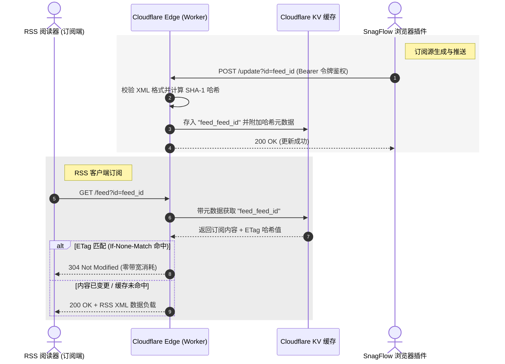

# 🛰️ SnagFlow RSS Bridge (高级版)

[English](README.md) | [简体中文](README_zh.md)

[](https://deploy.workers.cloudflare.com/?url=https://github.com/Pizone-ai/snagflow-rss-bridge)
[](LICENSE)
[](https://workers.cloudflare.com/)

基于 **Cloudflare Workers** 和 **Cloudflare KV** 构建的超快速、轻量且安全的无服务器网关。它作为 **SnagFlow** 视觉选择浏览器扩展所生成的本地 RSS 订阅源的公网分发桥梁。

---

## 🛠️ 系统架构

RSS Bridge 作为一个安全、全球分布的缓存层，将您的本地浏览器扩展同步与公网 RSS 阅读器的订阅请求进行解耦。



---

## 🚀 核心特性

*   **全球超低延迟**: 基于 Cloudflare 全球边缘网络运行，响应时间达到毫秒级。
*   **极致成本效益**: 依托 Cloudflare KV 无服务器存储，完美适配 Cloudflare 的免费额度（每日 10 万次请求）。
*   **智能 HTTP 缓存**: 完整实现 `ETag` 校验和 `If-None-Match` 机制，对未更新的内容返回 `304 Not Modified`，大幅节省客户端流量及边缘带宽。
*   **安全更新接口**: 更新端点通过 Bearer Token 进行强身份验证 (`AUTH_TOKEN`)，防止订阅源被他人恶意覆盖。
*   **支持 HEAD 请求**: 完美支持轻量化 `HEAD` 请求，供订阅客户端在不下载完整 XML 的情况下快速检测订阅源状态。

---

## 🚦 接口规范

### 1. GET `/feed`
获取 RSS 订阅源 XML 内容。

*   **请求路径**: `/feed?id=<FEED_ID>`
*   **请求方法**: `GET`
*   **请求头**:
    *   `If-None-Match` (可选) - 传入客户端已缓存的 ETag 值。
*   **响应状态**:
    *   `200 OK`: 返回完整的 RSS XML 文档。
    *   `304 Not Modified`: 订阅源未发生变更，客户端可直接使用本地缓存。
    *   `404 Not Found`: 缓存中不存在该订阅源 ID。

### 2. HEAD `/feed`
检查订阅源的存在性及 ETag 状态。

*   **请求路径**: `/feed?id=<FEED_ID>`
*   **请求方法**: `HEAD`
*   **响应状态**:
    *   `200 OK`: 返回与 `GET` 相同的响应头（包含 ETag），但无响应体。

### 3. POST `/update`
更新/上传 RSS XML 内容。通常由 SnagFlow 浏览器插件自动触发调用。

*   **请求路径**: `/update?id=<FEED_ID>`
*   **请求方法**: `POST`
*   **请求头**:
    *   `Authorization`: `Bearer <您的 AUTH_TOKEN>` (若已配置)
    *   `Content-Type`: `application/xml`
*   **请求体**: 原始 RSS XML 文本内容。
*   **响应状态**:
    *   `200 OK`: "Success"
    *   `401 Unauthorized`: 认证令牌失效或缺失。
    *   `400 Bad Request`: 内容为空、过短或不符合 XML 规范。

---

## ⚙️ 配置与部署指南

### 前置条件

确保您本地已安装 [Node.js](https://nodejs.org/) 并配置好 Wrangler 命令行工具：

```bash
npm install -g wrangler
wrangler login
```

### 1. 创建 KV 命名空间

在 Cloudflare 中创建一个用于存储 RSS 数据的 KV 命名空间：

```bash
wrangler kv:namespace create RSS_CACHE
```

执行后将输出对应的绑定配置。复制并替换您的 [wrangler.toml](wrangler.toml)：

```toml
[[kv_namespaces]]
binding = "RSS_CACHE"
id = "您的_KV_命名空间_ID"
```

### 2. 配置环境变量

为了保护更新接口，请配置 `AUTH_TOKEN` 密钥：

#### 本地开发环境
在项目根目录下创建 `.dev.vars` 文件：
```env
AUTH_TOKEN="您的安全令牌"
```

#### 生产部署环境
安全上传密钥至 Cloudflare 云端：
```bash
wrangler secret put AUTH_TOKEN
```

### 3. 部署

一键部署您的 Worker 至全球边缘节点：

```bash
wrangler deploy
```

---

## 📄 开源协议

本项目基于 MIT 协议开源 - 详情参见 [LICENSE](LICENSE) 文件。
